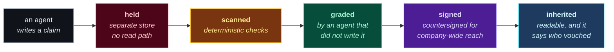

**Your company is paying to teach five hundred private AI agents, and keeping none of it.**

---

## The problem

Every engineer corrects their agent daily — a naming convention, a deployment gotcha, a
way round a broken API. That correction lands in one person's session history and dies
there. The next engineer starts from zero, and so does their agent.

A field experiment across **66 firms** found individual AI time savings with **no shift in
the quantity or composition of work** at the organizational level. The gains stay
single-player.

Meanwhile the fix has an obvious failure mode: pool everything, and you pool the mistakes
at the same speed as the insights. Across **fourteen memory providers** surveyed, none
holds a claim back pending review — confidence scores and decay change *ranking*, never
*visibility*.

## What doublegate does

Nothing an agent writes becomes readable until a reviewer that did not write it has
signed it. Two gates, hence the name.

The reviewer is never the author. That is not our invention — the ECB names the
**four-eyes principle** for overrides and sign-offs in its own words, and we implement it
mechanically.

## Four properties every artifact carries

| | |
|---|---|
| **Audited** | a signed verdict record says who approved it and why |
| **Traceable** | every belief links back to the evidence it came from |
| **Versioned** | nothing is edited in place; a correction is a new signed version |
| **Discoverable** | approved knowledge is searchable by the people scoped to it |

## Where it runs

| Scope | Boundary it serves | Price |
|---|---|---|
| **Solo** | one machine, no redistribution | free, open source |
| **Team** | one gate's authority | per active contributor |
| **Organization** | a *second independent* authority — the double gate | annual |
| **Commons** | your gate signs, the commons gate countersigns | free, outward-facing |

Tier boundaries follow the trust model, not the price sheet.

## Status: design phase

**There is no code yet.** What exists is a design package — requirements, architecture,
component contracts, decision records and cited research — plus the case for not building
it at all.

Published limits, on the site rather than buried: gate accuracy is unmeasured until we
measure it, there is no read-authorisation model yet, append-only conflicts with erasure
obligations until that is resolved, and Sybil resistance for the Commons is undesigned.

### Read more

[**How it works**](https://doublegate-io.github.io/how-it-works.html) ·
[**For organizations**](https://doublegate-io.github.io/for-organizations.html) ·
[**For engineers**](https://doublegate-io.github.io/for-engineers.html) ·
[**Governance**](https://doublegate-io.github.io/governance.html) ·
[**Commons**](https://doublegate-io.github.io/commons.html) ·
[**Pricing**](https://doublegate-io.github.io/pricing.html) ·
[**Evidence**](https://doublegate-io.github.io/evidence.html)

Every number above is traceable to a primary source on the evidence page, including the findings that work against us.

