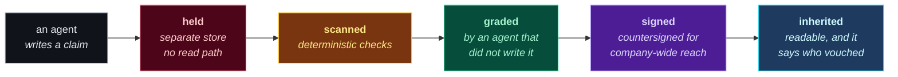

**Your company is paying to teach five hundred private AI agents, and keeping none of it.**

---

## What we are building

**Admission control for agent memory.** Nothing an agent writes becomes readable until a
reviewer that did not write it has signed it. Two gates — one on your machine, one for
your organization — hence the name.

Every other memory system treats a write as a fact. We treat it as a **claim**.

## Why it needs to exist

Two problems, and the second is why the obvious fix doesn't work.

**The knowledge dies in one session.** Every engineer corrects their agent daily — a naming
convention, a deployment gotcha, a way round a broken API. That correction lands in one
person's history and stops there. A field experiment across **66 firms** found individual
AI time savings with **no shift in the quantity or composition of work** at the
organizational level. The gains stay single-player.

**Pooling it pools the mistakes at the same speed.** Across **fourteen memory providers**
surveyed, not one holds a claim back pending review. Confidence scores and decay change
*ranking*, never *visibility* — so a wrong belief is a slightly lower-ranked wrong belief,
still readable, still actionable, forever.

So the useful thing and the dangerous thing are the same thing: shared agent memory. The
question is what gets in.

The reviewer is never the author. That isn't our invention — the ECB names the
**four-eyes principle** for overrides and sign-offs in its own words. We implement it
mechanically, on a write path, for machines.

## Who this is for

| If you are… | The question you have | Start here |
|---|---|---|
| **An engineer** evaluating a memory provider | What does it cost me, and what breaks? | [For engineers](https://doublegate-io.github.io/for-engineers.html) |
| **A platform or infra lead** with agents across teams | How do I share knowledge without sharing mistakes? | [For organizations](https://doublegate-io.github.io/for-organizations.html) |
| **Security, risk or audit** | Who approved this, and can I prove it later? | [Governance](https://doublegate-io.github.io/governance.html) |
| **A skeptic** | Is any of this actually true? | [Evidence](https://doublegate-io.github.io/evidence.html) |
| **A contributor** | Where is the design, and what's still open? | [the design package](#how-this-organization-is-laid-out) |

## What an engineer actually gets

**It replaces your memory provider — it does not sit in front of one.** You cannot enforce
a read boundary you do not own, so wrapping an existing provider was considered and
rejected. Your agent speaks the same interface it already speaks; one thing changes, which
is what gets in.

| | |
|---|---|
| **Read latency** | unchanged — the gate is not in the query path at all *(design requirement, not yet benchmarked)* |
| **Write latency** | fire-and-forget, target under 50 ms; review runs in a background loop so a slow reviewer never blocks your agent |
| **Tokens** | **a real new cost.** Grading calls a model. The system is required to report that spend rather than hide it |
| **What's reviewed** | claims only. Transcripts, tool output and logs pass straight through as records |

Four properties every artifact carries, because they share one write path and one journal:
**audited** (a signed verdict says who approved it and why), **traceable** (every belief
links to the evidence it came from), **versioned** (nothing edited in place — a correction
is a new signed version), **discoverable** (approved knowledge is searchable by whoever is
scoped to it).

## How it's sold, and why the tiers are shaped that way

Four scopes, one engine. **Tier boundaries follow the trust model, not the price sheet** —
each step out adds an authority, not a feature flag.

| Scope | Boundary it serves | What you're paying for | Price |
|---|---|---|---|
| **Solo** | one machine, no redistribution | nothing — it's the whole engine | free, open source |
| **Team** | one gate's authority | the shared gate and a review queue someone owns | per active contributor |
| **Organization** | a *second independent* authority | the double gate: independent second review, read scopes, real deletion, exportable audit trail | annual |
| **Commons** | your gate signs, the commons gate countersigns | nothing — it points outward | free |

Solo arrives with release 2; Team and Organization with release 4. That is what we are
building toward, not a price list you can buy from today.

## Status: design phase, and no code yet

What exists is a **design package** — requirements, architecture, component contracts,
decision records, cited research — **plus the argued case for not building it at all.**

The limits are published on the site rather than buried in an appendix:

- **Gate accuracy is unmeasured** until we measure it. Small classifiers in this role are
  evaded at 70–99.8% in the published literature, which is why one may contribute a finding
  and never clear one.
- **No read-authorisation model yet.** Everything designed so far governs admission; access
  is a named gap.
- **Append-only conflicts with erasure obligations**, and the resolution (crypto-shredding)
  is decided but unbuilt.
- **Sybil resistance for the Commons is undesigned.**

If one of those is disqualifying for you, that is the right conclusion to reach from this
page rather than three months in.

## How this organization is laid out

| Repo | What it is | |
|---|---|---|
| [**doublegate-io.github.io**](https://github.com/doublegate-io/doublegate-io.github.io) | the public site — static HTML, no build dependencies beyond Python 3 | public |
| **design** | the design package: requirements, architecture, ADRs, research, roadmap | private |
| [**.github**](https://github.com/doublegate-io/.github) | this profile, and the org-wide policies | public |

The design repo is private during the design phase. **The reason is honest rather than
strategic:** it contains an argued case against the project, and half-finished
self-criticism read cold is worse than no self-criticism. The parts that are ready to be
argued with are on the site, and the [evidence page](https://doublegate-io.github.io/evidence.html)
carries the sources — including the findings that work against us.

Want in earlier? [Ask](mailto:eugene.korniichuk@gmail.com?subject=doublegate%20—%20design%20package%20access).

## Talk to us

- **Deployment, pricing, or "would this work for us"** — [email](mailto:eugene.korniichuk@gmail.com?subject=doublegate%20—%20deployment%20and%20pricing)
- **An objection, a correction, or a citation we got wrong** — [open an issue](https://github.com/doublegate-io/doublegate-io.github.io/issues).
  Corrections to the evidence page are the most useful thing anyone can send us.
- **A vulnerability** — see [SECURITY.md](https://github.com/doublegate-io/.github/blob/main/SECURITY.md). Do not open a public issue.
- **Anything else** — [SUPPORT.md](https://github.com/doublegate-io/.github/blob/main/SUPPORT.md) says where each kind of question goes, and what to expect from a project maintained by one person.

### Read the whole argument

[**How it works**](https://doublegate-io.github.io/how-it-works.html) ·
[**For organizations**](https://doublegate-io.github.io/for-organizations.html) ·
[**For engineers**](https://doublegate-io.github.io/for-engineers.html) ·
[**Governance**](https://doublegate-io.github.io/governance.html) ·
[**Commons**](https://doublegate-io.github.io/commons.html) ·
[**Pricing**](https://doublegate-io.github.io/pricing.html) ·
[**Evidence**](https://doublegate-io.github.io/evidence.html)

Every number on this page is traceable to a primary source on the evidence page, including the findings that work against us.

